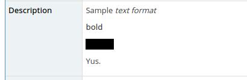
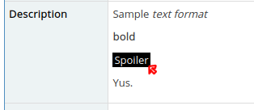

Add support for spoiler tags to your mantisbt.

Spoilers show when they are hovered over:

# Installation

1. Drop this repo into a new "SpoilerTag" folder in plugins folder
2. Activate in Mantis settings panel

# How to use

Wrap spoilers in double pipe characters: ||

Ex:  || Spoiler ||

# Current Status

| Location                        | Status                                                       |
|---------------------------------|--------------------------------------------------------------|
| Formatted Text (ex: issue page) | ✔️ Implemented                                                |
| RSS                             | ❌ Not yet (not needed on my install, feel free to send a PR) |
| E-mail                          | ❌ Not yet (not needed on my install, feel free to send a PR) |
| Discord                         | ✔️ Uses same syntax, so just works                            |